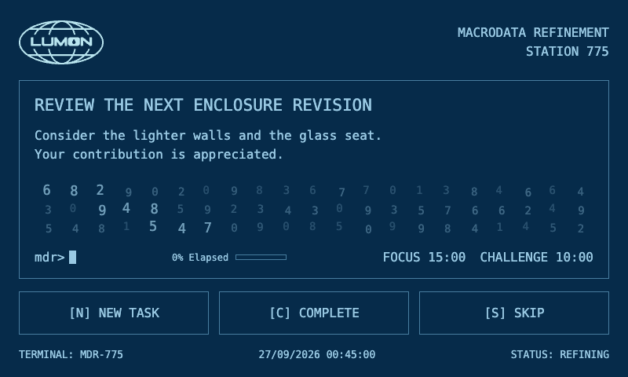

# LumonTasker

A working desktop task terminal inspired by *Severance*: a Raspberry Pi 3 Model B,
touchscreen and thermal ticket printer in a custom two-bay enclosure.

The assembled prototype works. The terminal selects tasks from Trello locally,
prints tickets, and records completion or deferral. Its default UI is a simple
blue monospace screen with the Lumon globe, a focus countdown, elapsed-time
progress and a small animated number field. An alternate MDR-style layout is
available by tapping the logo. The separate message-printing integration on the
Pi/mothra remains in service; its deployment source has not yet been imported
into this repository.



This repository is private while the project is being developed.

## Project contents

| Path | Contents |
| --- | --- |
| [software/](software/README.md) | Pi application, both terminal layouts, assets, isolated checks and deployment records. |
| [cad/](cad/README.md) | Parametric Python CAD sources, hardware measurements, assembly reviews and engineering notes. |
| [cad/output/](cad/output/) | Versioned STEP assemblies, STL meshes, Bambu Studio projects and existing sliced print files. |
| [cad/CURRENT_PRINT_FILES.md](cad/CURRENT_PRINT_FILES.md) | Index of the parts used in the accepted physical build. |
| [files/](files/) | Earlier design sources and exports, preserved as a historical archive. |

## Software setup

Use a Python environment separate from the CAD environment. The dependency
versions in `software/taskticket/requirements.txt` match the working Pi setup.

```sh
cd software/taskticket
python3 -m venv venv
. venv/bin/activate
pip install -r requirements.txt
cp .env.example .env
cp config/settings.example.py config/settings.py
```

Fill in your Trello key, token and board ID in `.env`. The expected board lists
are `TODO`, `DOING`, `DONE` and optionally `Better than nothing`. AI is disabled
by default; ordinary task selection does not require an OpenRouter account.

```sh
python main.py
```

Open `http://localhost:5000/display`. The optional layout is
`http://localhost:5000/display?theme=mdr`. The application expects a configured
USB thermal printer on the Pi; use the isolated preview below to inspect the UI
without hardware or Trello access. Production kiosk startup is described in
[the software notes](software/README.md); historical deployment scripts contain
guards for specific past versions and are not a general installer.

From the project root, with the software environment activated:

```sh
python software/preview/check_backend.py
python software/preview/check_selection.py
python software/preview/check_routes.py
python software/preview/server.py
```

The last command serves a fake-task UI at `http://127.0.0.1:8655/display` and
does not contact the Pi, Trello or a printer.

## Hardware and printing

The current complete assembly is
[LUMON_v51_GLUE_DC_INLET_ASSEMBLY.step](cad/output/v51_dc_inlet_panel/LUMON_v51_GLUE_DC_INLET_ASSEMBLY.step).
STEP files can be imported into Fusion; the editable geometry sources are the
Python generators under `cad/` and `cad/review/`. The working Fusion cloud
documents are not native `.f3d` files in this checkout.

The accepted build combines parts from several revisions. Start with
[the current print-file index](cad/CURRENT_PRINT_FILES.md), not the highest
version number of every historical part. `.3mf` files are Bambu Studio projects;
`.gcode.3mf` files contain already sliced jobs for the original P1S setup.
Check the model, plate, filament mapping and supports in your slicer before
reusing a job on another setup. Current colours are cotton-white PLA, navy-blue
PLA and a separate translucent PETG LED insert.

For CAD development:

```sh
python3 -m venv .venv
.venv/bin/pip install -r cad/requirements.txt
```

Follow the generator and revision notes in `cad/review/`. New revisions still
need the lighter walls, improved roof supports, larger display-glass seat,
closed printer-base underside and removal of the identified unused insert hole.
Those changes are recorded feedback, not changes already applied to the printed
prototype. See [build status](cad/BUILD_STATUS.md) for the full history.

## Local-only data

Credentials, `.env`, personal biography/preferences, task history, virtual
environments, temporary files, deployment bundles and original personal photos
are excluded by `.gitignore`. Blank configuration examples and font licences
are included. Third-party scene clips used for visual reference remain local;
their source links are documented under `software/references/`.
