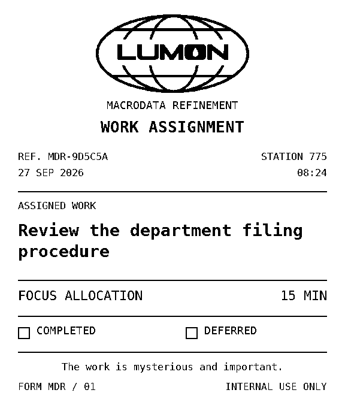

# Lumon work slips



Original *Severance*-inspired internal stationery, designed for the accepted
POS80 printer. This is not claimed to reproduce a screen-used paper prop.
The reference images contain synthetic tasks; no real Trello titles are stored.

The layout uses the existing Lumon globe, one DejaVu Sans Mono family in two
weights, thin rules and a clear assignment section. Station 775 matches the
terminal. A stable short reference is derived from the task ID; the issue date
and time use the configured timezone. The time field says **Focus allocation**
for the current selector and **Time estimate** for older estimated tickets.
Optional challenge times and older task-specific guidance remain available.
The paper checkboxes can be marked by hand; they do not change software state.
The random euro-value line and duplicate focus-session sentence are removed.

Rendering happens at the actual 576-dot printable width, with 30-dot side
margins. Normal task text is 28 dots high; supporting fields are 16–22 dots.
At 203 dpi, the illustrated two-line assignment uses roughly 85 mm of artwork
plus the printer's cutter margin. Long titles grow the slip rather than being
clipped or abbreviated. Accented text is rendered directly, avoiding the
printer firmware's inconsistent handling of UTF-8.

The same 1-bit pixels are used for the preview and USB job. They are sent as
contiguous 128-row raster strips with no intervening newlines, then one final
cut. Each strip is about 9 KB at 576 dots. This follows the beginning-of-line
and paper-feed behavior in the
[Epson ESC/POS raster reference](https://download4.epson.biz/sec_pubs/pos/reference_en/escpos/gs_lv_0.html)
and uses the command already confirmed on this POS80. The protocol is not
assumed to work on every other printer model. Missing assets fall back to a
readable native-text work slip before any USB write is attempted; failure after
writing starts never triggers a second fallback ticket.

To regenerate these previews without contacting hardware or Trello:

```sh
python software/preview/render_tickets.py
```

Also inspect [long-title.png](long-title.png) and
[accented-title.png](accented-title.png). The standalone physical sample has a
small **LAYOUT PROOF / NO TASK ISSUED** footer; normal task tickets omit it.
